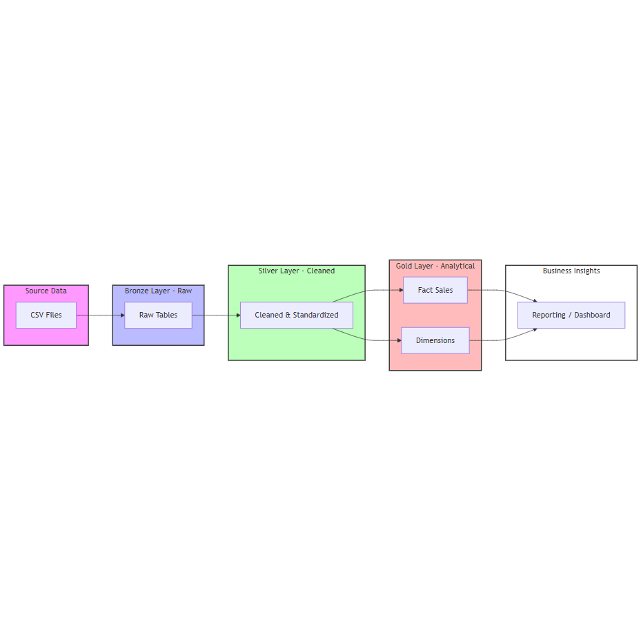

# Architecture Design

## Data Flow
1.  **Source Systems**: Olist E-Commerce CSV datasets (Customers, Orders, Items, etc.).
2.  **Bronze Layer**: Raw data ingestion into SQL Server bronze schema using BULK INSERT. Tables: 
aw_customers, 
aw_orders, etc.
3.  **Silver Layer**: Data cleansing and standardization in silver schema via T-SQL scripts. Tables: cl_customers, cl_orders, etc.
4.  **Gold Layer**: Analytical modeling using Star Schema in gold schema. 
    - **Fact Table**: fact_sales (Grain: Order Item).
    - **Dimensions**: dim_customers, dim_products, dim_sellers, dim_date.

## Technology Stack
- **Database**: Microsoft SQL Server
- **ETL/ELT**: T-SQL (Stored procedures / scripts).
- **Modeling**: Star Schema methodology.
- **Data Prep**: PowerShell for file normalization.

## Diagram

The diagram shows a linear flow from left to right:
- **Source**: Raw CSV files.
- **Bronze**: Ingestion into raw tables.
- **Silver**: Cleaning and standardization.
- **Gold**: Modeling into Facts and Dimensions.
- **Analytics**: Business insights and reporting.
